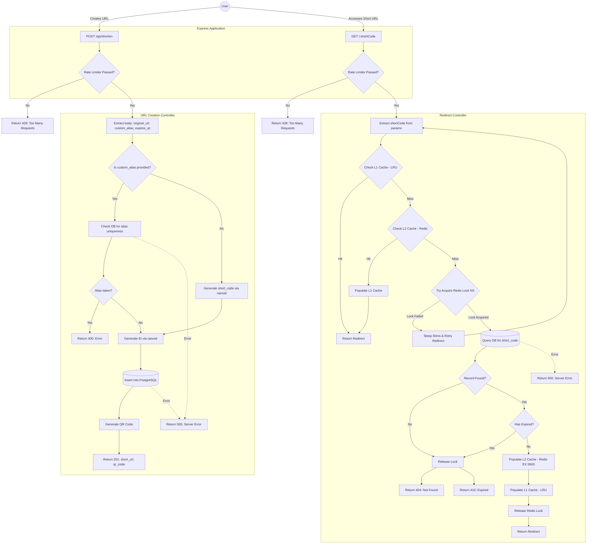

# Shortify Workflow Architecture

This document outlines the detailed workflow of the Shortify URL shortener, including both URL creation and the multi-tiered cache redirection mechanism.

## System Workflow Diagram

### Detailed Steps Explained

#### 1. Rate Limiting (Token Bucket)
Every request hitting `/api/shorten` or `/:shortCode` goes through the `tokenBucketLimiter`. It checks a Redis hash for the user's IP. It allows a burst of 5 requests and refills at a rate of 1 token per second. If tokens are `< 1`, it immediately returns a `429 Too Many Requests`.

#### 2. Short URL Creation (`POST /api/shorten`)
- Extracts the requested data from the payload.
- If a custom alias is provided, it validates its uniqueness against PostgreSQL. If taken, returns `400`.
- If no alias is provided, generates a random 7-character string using `nanoid`.
- Creates a 15-character UUID for the primary key.
- Persists the URL mapping into PostgreSQL.
- Generates a Base64-encoded QR Code for the short URL.
- Returns a `201` status with the shortened URL and QR code.

#### 3. URL Redirection (`GET /:shortCode`)
This workflow features a robust multi-tiered caching system with stampede prevention:
- **L1 Cache (In-Memory LRU)**: Checks the Node.js LRU cache first. If a hit occurs, redirects immediately.
- **L2 Cache (Redis)**: If L1 misses, it checks Redis. If a hit occurs, it populates the L1 cache for subsequent requests and redirects.
- **Cache Stampede Prevention**: If both caches miss, it attempts to acquire a short-lived distributed lock in Redis (`lock:shortCode` with `NX`). 
  - If it fails to acquire the lock (meaning another process is already fetching the data from the DB), it sleeps for 50ms and retries the entire redirect function recursively.
- **Database Fetch**: The process that acquired the lock fetches the original URL and expiry data from PostgreSQL.
- **Validation**: Checks if the record exists (returns `404` if not) and checks if the URL has expired (returns `410` if so). It releases the lock in both failure cases.
- **Cache Warming**: Populates Redis (L2) with a 3600-second TTL, then populates the LRU (L1).
- **Completion**: Releases the Redis lock and issues the HTTP redirect to the original URL.
